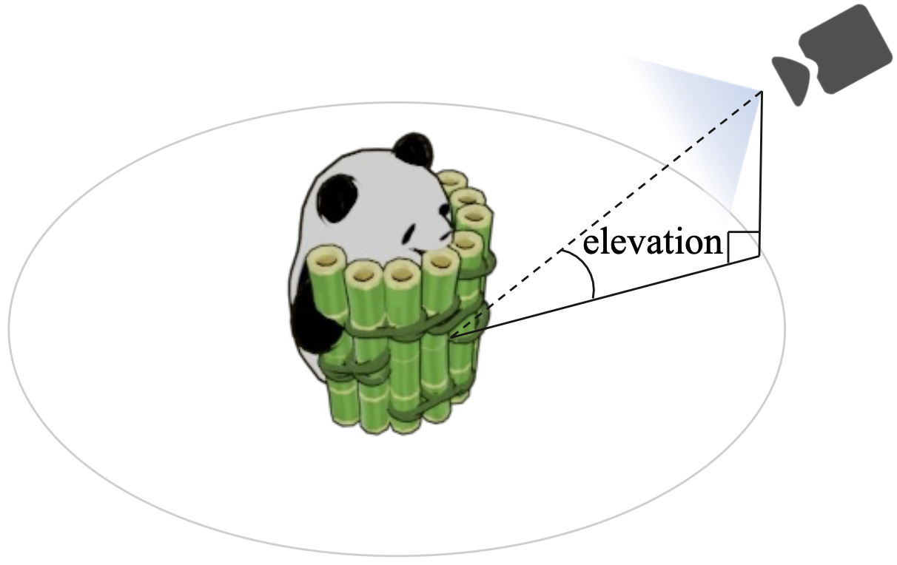

<!-- # DreamComposer -->
<div align="center">
  
</div>
<h1 align="center">DreamComposer: Controllable 3D Object Generation via Multi-View Conditions</h1>
<p align="center">

## [Project Page](https://yhyang-myron.github.io/DreamComposer/) | [Paper](https://arxiv.org/abs/2312.03611)


### Conda Environment
Install packages in `requirements.txt`. We test our model on a 24G RTX4090 GPU with Python 3.10, CUDA 11.8 and Pytorch 2.0.1.
```angular2html
conda create -n dreamcomposer
conda activate dreamcomposer
pip install -r requirements.txt
pip install git+https://github.com/NVlabs/tiny-cuda-nn/#subdirectory=bindings/torch
```

### Preparation for inference

1. Download checkpoints [here](https://connecthkuhk-my.sharepoint.com/:f:/g/personal/yhyang07_connect_hku_hk/EudgwZJnLUtBiSohahgiT-4BgVn7oGGyndRWxvh5wtLbmw?e=AudlzM). ([Here](https://sushantag9.medium.com/download-data-from-onedrive-using-command-line-d27196a676d9) is a simple tutorial for downloading data from ONEDRIVE using command line.)
2. Remove the background of images with [Clipdrop](https://clipdrop.co/remove-background).

### Inference
Parameters Explanation:

- `--ckpt` is the checkpoint to load.
- `--output` is the output directory.
- `--sample_num` is the number of instances to generate. `sample_num 4` means generating 4 times.
- `--cfg_scale` is the *classifier-free-guidance*.
- `--elevation` is the elevation angle of the input image in degree. As shown in the following figure. (Don't need a very accurate elevation, but a rough value in [0,40] is OK, e.g. {0,15,30}.)
- `--crop_size` Resize the input image to the crop_size, and then put it into an 256\*256. crop_size=-1 means do not resize the object but only directly resize the input image to 256*256.

<div align="center">
  
</div>

#### DC-Zero-1-to-3
1. Make sure you have the following models.
```bash
DreamCompoer
|-- ckpt
    |-- DC_zero123.ckpt
```
2. Set the input images paths and azimuths at `# prepare data` in dc_zero123_nvs.py.
2. Run DreamCompoer to produce controllable novel views with a better local control.
```bash
python dc_zero123_nvs.py --ckpt ckpt/DC_zero123.ckpt \
                   --output output_imgs/dc_zero123/alarm \
                   --target_azim 45 \
                   --sample_num 4 \
                   --cfg_scale 2.0 \
                   --elevation 30 \
                   --crop_size -1 \
                   --seed 6033
```

#### DC-SyncDreamder
1. Make sure you have the following models.
```bash
DreamCompoer
|-- ckpt
    |-- ViT-L-14.ckpt
    |-- DC_syncdreamer.ckpt
```
2. Set the input images paths and azimuths at `# prepare data` in dc_syncdreamer_nvs.py.
3. Run DreamCompoer to produce controllable and consistent novel views.
```bash
python dc_syncdreamer_nvs.py --ckpt ckpt/DC_syncdreamer.ckpt \
                   --output output_imgs/dc_syncdreamer/alarm \
                   --sample_num 4 \
                   --cfg_scale 2.0 \
                   --elevation 30 \
                   --crop_size -1 \
                   --seed 6033
```

4. Following SyncDreamer, we use NeuS for 3D reconstruction to generate videos and meshes.
```bash
python train_renderer.py -i output_imgs/alarm/0.png \
                         -n alarm-neus \
                         -b configs/neus.yaml \
                         -l output/renderer 
```

Parameters Explanation:
- `-i` contains the multiview images generated by DC-SyncDreamer.
- `-n` means the name. 
- `-l` means the log dir. Results will be saved to `<log_dir>/<name>` i.e. `output/renderer/alarm-neus`.

### Preparation for training
1. Generate multi-view renderings or download public rendering data. Need rendered images such as camera elevation unchanged and azimuth changing from 0° to 360°. (e.g. [SyncDreamer](https://github.com/liuyuan-pal/SyncDreamer), [Gobjaverse](https://github.com/modelscope/richdreamer/tree/main/dataset/gobjaverse))
2. Modify the dataset in *ldm/data/objaverse.py*.
3. Donwload the pretrained zero123-xl model [here](https://zero123.cs.columbia.edu/assets/zero123-xl.ckpt).
4. Donwload the pretrained syncdreamer model [here](https://connecthkuhk-my.sharepoint.com/:f:/g/personal/yuanly_connect_hku_hk/EjYHbCBnV-VPjBqNHdNulIABq9sYAEpSz4NPLDI72a85vw).

### Training
1. Pre-train the 3D lifting module

```bash
python dc_zero123_training.py \
    -t \
    -n lifting_3d \
    --base configs/DC_3d_lifting.yaml \
    --gpus 0,1,2,3,4,5,6,7 \
    --scale_lr False \
    --num_nodes 1 \
    --seed 42
```

2. Train DC_Zero123

Make sure you have the following models:
```bash
DreamCompoer
|-- ckpt
    |-- zero123-xl.ckpt
    |-- lifting_3d.ckpt
```
Run:
```bash
python dc_zero123_training.py \
    -t \
    -n dc_zero123 \
    --base configs/DC_zero123.yaml \
    --gpus 0,1,2,3,4,5,6,7 \
    --scale_lr False \
    --num_nodes 1 \
    --seed 42 \
    --finetune_from ckpt/zero123-xl.ckpt \
    --lift3d_ckpt ckpt/lifting_3d.ckpt
```

3. Train DC_SyncDreamer

Make sure you have the following models:
```bash
DreamCompoer
|-- ckpt
    |-- ViT-L-14.ckpt
    |-- syncdreamer-pretrain.ckpt
    |-- lifting_3d.ckpt
```
Run:
```bash
python dc_syncdreamer_training.py \
    -t \
    -n dc_syncdreamer \
    --base configs/DC_syncdreamer.yaml \
    --gpus 0,1,2,3,4,5,6,7 \
    --scale_lr False \
    --num_nodes 1 \
    --seed 42 \
    --finetune_from ckpt/syncdreamer-pretrain.ckpt \
    --lift3d_ckpt ckpt/lifting_3d.ckpt
```

## Acknowledgement
DreamComposer is inspired by the following repos: [zero123](https://github.com/cvlab-columbia/zero123), [SyncDreamer](https://github.com/liuyuan-pal/SyncDreamer), [threestudio](https://github.com/threestudio-project/threestudio), [camtools](https://github.com/yxlao/camtools), [eg3d](https://github.com/NVlabs/eg3d), [ControlNet](https://github.com/lllyasviel/ControlNet), [NeuS](https://github.com/Totoro97/NeuS). 

Many thanks to the authors for sharing their codes.

## Citation
If you find _DreamComposer_ useful in your project, please cite our work. :)
```
@article{yang2023dreamcomposer,
    title={DreamComposer: Controllable 3D Object Generation via Multi-View Conditions},
    author={Yang, Yunhan and Huang, Yukun and Wu, Xiaoyang and Guo, Yuan-Chen and Zhang, Song-Hai and Zhao, Hengshuang and He, Tong and Liu, Xihui},
    journal={arXiv preprint arXiv:2312.03611},
    year={2023}
}
```
