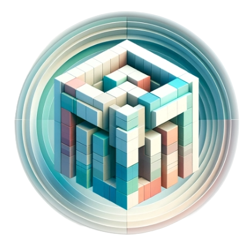

<!-- # DreamComposer -->

  

<h1 align="center">DreamComposer: Controllable 3D Object Generation via Multi-View Conditions</h1>

## [Project Page]() | [Paper]()

**Code will come soon.**

Abstract: *Utilizing pre-trained 2D large-scale generative models, recent works are capable of generating high-quality novel views from a single in-the-wild image. However, due to the lack of information from multiple views, these works encounter difficulties in generating controllable novel views. In this paper, we present DreamComposer, a flexible and scalable framework that can enhance existing view-aware diffusion models by injecting multi-view conditions. Specifically, DreamComposer first uses a view-aware 3D lifting module to obtain 3D representations of an object from multiple views. Then, it renders the latent features of the target view from 3D representations with the multi-view feature fusion module. Finally the target view features extracted from multi-view inputs are injected into a pre-trained diffusion model. Experiments show that DreamComposer is compatible with state-of-the-art diffusion models for zero-shot novel view synthesis, further enhancing them to generate high-fidelity novel view images with multi-view conditions, ready for controllable 3D object reconstruction and various other applications.*

## Method Overview

